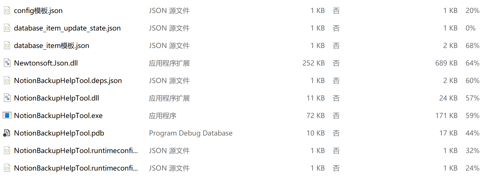

# 功能

本工具是 [Notion自动化导出备份——自由度高，内容更丰富_哔哩哔哩_bilibili](https://www.bilibili.com/video/BV13A411r7K8/?spm_id_from=333.999.0.0) 的补充，配置好笔记分组的token和备份数据库的token后，执行程序可以自动将分组下的笔记条目增加到备份数据库，免去手动添加的麻烦。

# 使用说明

1. 直接下载仓库中的 NotionBackupHelpTool.zip 即可

1. 文件说明

   

- NotionBackupHelpool.exe : 主程序

- config模板.json：token和备份数据库页面的id配置模板，token和页面id的获取在原视频中有介绍，这里不再赘述。修改后将“模板”去掉，文件名改为config.json

  

- database_item模板.json：往备份数据库中插入条目使用的模板，需要把database的id填入，修改后将“模板”去掉，文件名改为database_item.json

  

- database_item_update_state.json：备份数据库中选中“备份”复选框使用的模板

  只有config模板.json和database_item模板.json需要修改，其他不需要动。

2. 示例

   在笔记分组中添加Connections（只读权限即可）

   
   
   
   
   在备份数据库页面中添加Connections（读写权限）
   

​		 关联好权限和配置好token后，执行NotionBackupHelpool.exe 即可

# 注意

笔记的标题名长度不要过长，过长的名字会被截断，不截断会导致up主的备份程序备份失败，原因是路径过长，windows上会报找不到路径问题。

程序中处理原则：windows 最长路径长度为260,给用户预留80个作为自定义路径名，目录分隔符和文件名后缀预留10个，备份文件+目录名使用170个。